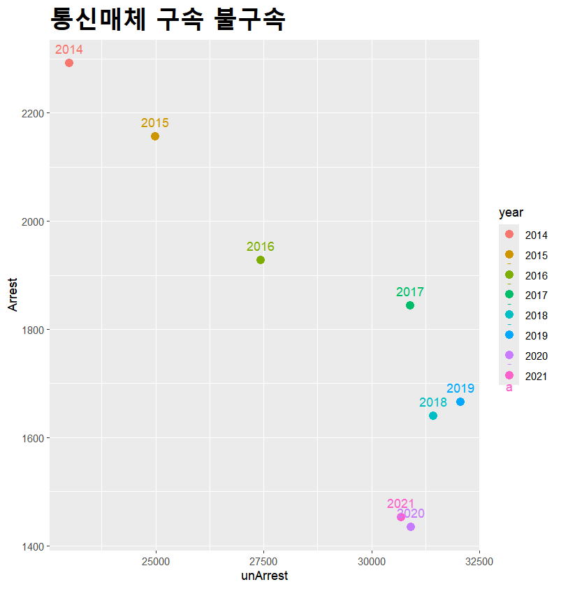
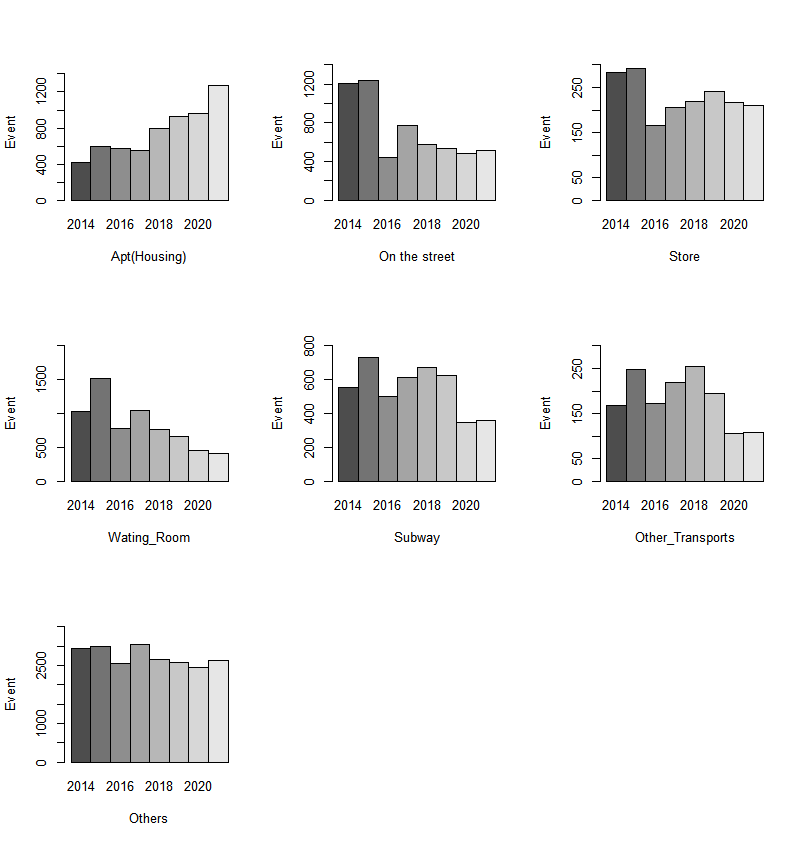
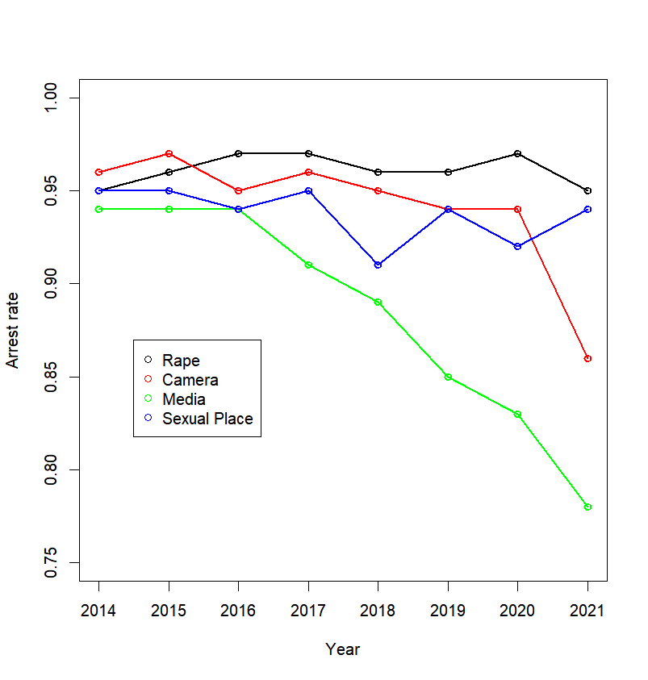
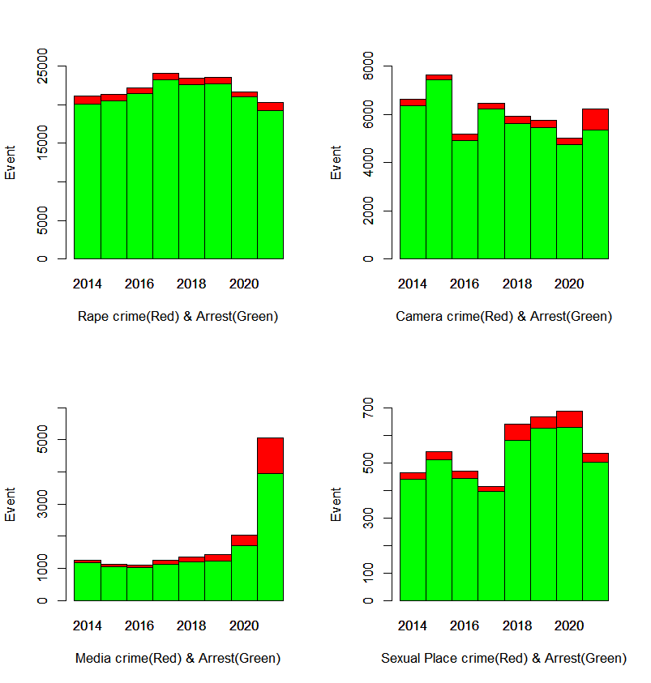

# 성범죄 발생률과 검거율의 상관관계
최근 성범죄 관련 기사가 급증하고 있으며, 불법 촬영이나 메타버스 아동성범죄 등 다양한 형태의 사건이 끊임없이 보도되고 있다. 과거에 비해 성범죄 발생이 눈에 띄게 증가하고 있는 상황이지만, 체포율은 그에 미치지 못하고 있는 실정이다. 성범죄가 실제로 얼마나 늘어나고 있으며, 그 원인은 무엇인지 파악하고자 이 주제를 연구하고자 한다.

## [Detection or Release in Media-related Crimes.R](R/Detention_or_Release_in_Media-related_Crimes.R)
이 산포도는 2014년부터 2021년까지 여러 해 동안 구속도니 사람 수와 불구속된 사람 수의 관계를 보여준다.

- **연도별 경향**: 시간이 지남에 따라 구속자 수는 줄어드는 반면 불구속자 수는 증가하는 경향을 보인다.
- **주목할 변화**: 2020년과 2021년에는 불구속 자가 크게 늘어난 반면, 구속자 수는 감소하는 모습을 보인다.
- **결론**: 통신매체 관련 범죄가 점점 더 해결되지 않거나, 법 집행이 이러한 범죄를 다루는 데 있어 어려움을 겪고 있다.

## [Locations_of_Illegal_Filming.R](R/Locations_of_Illegal_Filming.R)
이 막대 그래프는 22014년부터 2021년 동안 다양한 장소에서 발생한 불법 촬영 사건 수를 보여준다(주거지, 거리, 상점, 대기실, 지하철 등).

- **주거지 범죄 증가**: 주거지에서의 범죄가 시간이 지남에 따라 눈에 띄게 증가했으며, 특히 2018년과 2020년 사이에 크게 늘어났다.
- **공공장소 범죄 감소 또는 안정**: 거리, 상점, 대기실 등 공공장소에서의 범죄는 비교적 안정적이거나 감소하는 추세를 보인다.
- **결론**: 불법 촬영 범죄가 공공장소보다는 점점 더 사적인 공간(예: 주거지)을 대상으로 변화하고 있다.

## [Sex_Crime_Arrest_Rate.R](R/Sex_Crime_Arrest_Rate.R)
이 꺾은선 그래프는 2014년부터 2021년까지 성범죄 유형별(강간, 카메랄 범죄, 매체 범죄, 성적 장소 범죄) 검거율을 보여준다.

- **특정 범죄의 검거율 감소**: 특히 '매체 범죄'와 '성적 장소 범죄'의 검거율이 2017년 이후로 크게 감소했다. '매체 범죄'는 시간이 지남에 따라 꾸준히 감소하고, '성적 장소 범죄'는 2018년 이후 급격히 하락했다.
- **다른 범죄의 검거율 인정**: 강간과 카메라 범죄의 검거율은 비교적 안정적이지만, 말미에 다소 감소하는 경향이 보인다.
- **결론**: 매체 관련 범죄와 성적 장소 범죄에 대한 검거율 감소는 이러한 범죄를 다루는 데 있어 범 집행이 점점 더 까다로워지고 있음을 시사한다.

## [Sex_Crime_Occurrence_N_Arrest.R](R/Sex_Crime_Occurrence_N_Arrest.R)
이 누적 막대 그래프는 2014년부터 2021년까지 다양한 성범죄의 총 발생 건수(빨간색)와 검거 건수(녹색)을 보여준다(강간, 카메라 범죄, 매체 범죄, 성적 장소 범죄)

- **범죄 발생과 검거의 격차**: 매체 범죄와 성적 장소 범죄에서 범죄 발생 건수와 검거 건수 사이에 눈에 띄는 격차가 있다. 이 격차는 시간이 지날수록 커지는 경향을 보인다.
- **매체 범죄 급증**: 매체 범죄는 2020년에 특히 크게 증가했으며, 검거 건수도 늘어났지만 여전히 해결되지 않은 범죄가 많다.
- **강간 범죄 정체**: 강간 범죄 발생은 수년간 정체 상태에 있으며, 검거율도 꾸준하다.
- **결론**: 일부 범죄, 특히 매체 관련 범죄에 대한 검거 건수가 늘어나고 있지만 여전히 해결되지 않은 범죄가 많아, 법률적 및 집행상의 강화가 필요하다는 점을 시사한다.

## 인사이트
### 1. 통신매체를 통한 범죄 증가 및 수사력의 한계
- **범죄 증가와 수사력의 미비**: 통신매체를 통한 범죄에서 **체포되지 않은 인원**의 증가세가 두드러지며, 이는 단순히 범죄 발생이 늘어난 것을 넘어 **수사 및 체포가 점점 더 어려워지고 있음**을 시사한다. 이는 **기술 발전에 따른 범죄의 복잡화**나 **범죄자들이 법망을 피해가는 수법의 고도화**로 인한 것일 가능성이 크다. 예를 들어, **디지털 장비의 발달**, **익명화 기술**(VPN, 다크웹 등) 등의 사용으로 인해 범죄자의 신원 추적이 어려워지고, 이에 따라 범죄자들이 구속되지 않고 풀려나는 비율이 증가한 것으로 보인다.
- **법적 대응 및 수사 역량 강화 필요성**: 이런 경향은 단순한 수치적 문제에 그치는 것이 아니라, **사회적 불안감**을 증대시키는 요인이 될 수 있다. 통신매체를 통한 범죄가 급증하는 상황에서, 기존 법체계와 수사 기법이 이와 같은 새로운 유형의 범죄를 제대로 대응하지 못하고 있다는 점에서 **법적·제도적 개선**이 시급하다.

### 2. 불법 촬영 범죄의 이동: 공공장소에서 사적인 공간으로
- **사적인 공간에서의 범죄 증가**: 불법 촬영 범죄가 **주거지**와 같은 사적인 공간에서 급격히 증가하고 있다는 점은 매우 중요한 변화다. 이는 단순히 **대중교통**이나 **공공장소**에서 이루어지는 범죄에서 벗어나, **더 은밀하고 접근하기 어려운 공간**에서 범죄가 이루어지고 있음을 의미한다. 특히 아파트나 대기실 같은 공간에서의 범죄는 **개인의 프라이버시를 직접적으로 침해**하는 양상이 두드러지고 있어 심각한 사회적 문제로 자리잡을 수 있다.
- **방범 및 보호 시스템의 강화 필요성**: 이러한 변화는 기존의 방범 대책이나 공공장소 중심의 범죄 예방 노력에서 **사적 공간으로의 방범 인프라 확대** 필요성을 시사한다. 예를 들어, **주거지 내의 CCTV 설치 확대**, **프라이버시 보호를 위한 기술적 지원**(스마트홈 보안 시스템 등)과 같은 대응이 고려될 수 있다. 또한 **개인의 자율적인 경각심**을 높이기 위한 교육 및 캠페인도 강화되어야 한다.

### 3. 성범죄 검거율의 하락: 기술 기반 범죄의 수사 어려움
- **카메라 및 미디어 관련 범죄**의 검거율이 급격히 하락하고 있는 것은 **디지털 성범죄의 수사 어려움**을 그대로 반영한다. 특히 **불법 촬영 범죄**는 피해자에게 지속적인 정신적 피해를 주고 있지만, 범죄자들이 디지털 공간을 이용해 범행을 은폐하거나 유포하는 방식이 점점 정교해지고 있어, 수사기관의 **추적 및 검거 능력**이 이를 따라잡지 못하는 상황이다.
- **수사 역량 및 기술적 대응**: 이러한 범죄는 단순한 체포율 하락으로 그치지 않고, 피해자들의 **2차 피해**로 이어지는 경우가 많다. 따라서 수사기관이 **디지털 수사 역량**을 강화하고, **사이버 범죄 전담 부서**의 확충, **전문 인력 양성**, **최신 디지털 추적 기술 도입** 등이 필수적이다. 나아가, 법적 대응 역시 **디지털 증거**의 효용성을 강화하고, **강력한 처벌 기준**을 마련할 필요가 있다.

### 4. 성범죄 발생 건수와 체포 건수 간의 격차
- **미디어 범죄의 발생 증가와 검거율 감소**: 미디어와 관련된 성범죄의 경우 발생 건수는 계속해서 급증하고 있지만, 그에 비해 **체포율이 이를 따라가지 못하고 있는 현상**이 두드러진다. 이는 기술적 요인뿐 아니라, 수사 과정에서의 **증거 확보 어려움** 및 **법적 공백**이 주요 원인일 가능성이 크다. 특히 **다크웹이나 클라우드 서버**를 이용한 범죄 자료 저장 및 유포는 기존 수사 방식으로는 한계가 있음을 나타낸다.
- **성범죄에 대한 사회적 대응 강화**: 성범죄, 특히 미디어와 관련된 성범죄의 급증은 더 이상 단순한 개인 문제를 넘어 **사회적 문제**로 인식되어야 한다. 이를 해결하기 위해서는 **법 집행 강화**뿐만 아니라, **피해자 보호 시스템 강화**와 **사회 전반의 인식 전환**도 필요하다. 디지털 성범죄 피해자는 범죄 이후에도 피해 영상의 유포 등으로 인해 지속적인 고통을 겪게 되므로, **피해 영상 삭제 지원**과 같은 제도가 강화되어야 한다.

### 5. 종합 결론
- **디지털 성범죄의 복잡성 증가**: 전체적으로, 성범죄 중에서도 **카메라 및 미디어를 이용한 범죄**가 급증하고 있으며, 이와 같은 범죄 유형은 **수사 기관이 따라가기 어려운 수준**으로 발전하고 있다. 기술을 활용한 범죄는 점점 더 교묘해지고, 법망을 피해가는 방식이 정교해짐에 따라, **전통적인 수사 및 법적 대응 방식**으로는 한계에 직면하고 있다.
- **법적, 기술적 대안 필요**: 이를 해결하기 위해서는 **법적 제도의 개편**과 함께, **디지털 수사 기술의 도입** 및 **수사 기관의 전문성 강화**가 필수적이다. 나아가, **범죄 예방을 위한 교육 강화**와 **사회적 인식 변화**를 통해 이러한 범죄가 근절될 수 있도록 하는 다각적인 접근이 필요하다.
